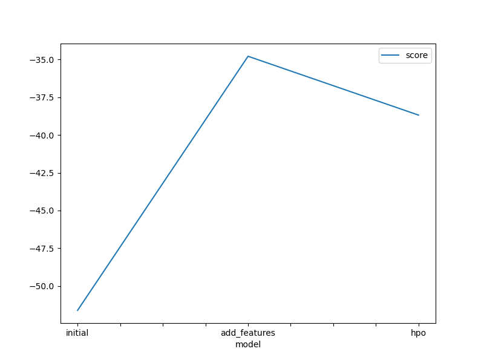
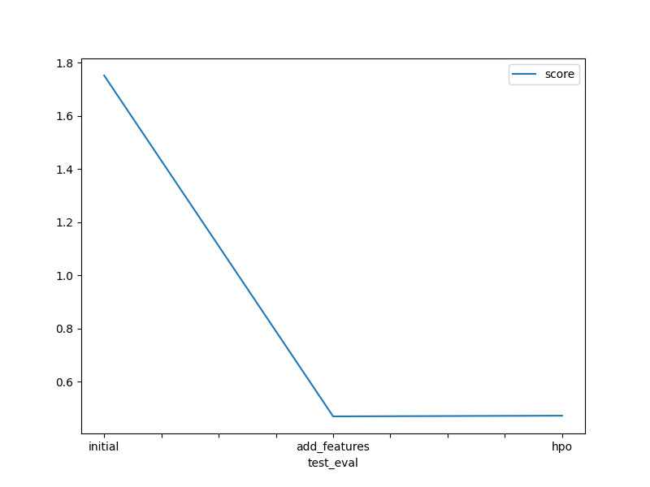

# Report: Predict Bike Sharing Demand with AutoGluon

## Initial Training

### What did you realize when you tried to submit your predictions? What changes were needed to the output of the predictor to submit your results?

When submitting the initial predictions, it was realized that Kaggle would reject the submission if there were any negative values in the predictions. Therefore, it was necessary to ensure that all prediction values were greater than zero.

### What was the top ranked model that performed?

The top-ranked model in the initial training was `WeightedEnsemble` with the lowest root mean squared error (RMSE) on the validation set.

## Exploratory data analysis and feature creation

### What did the exploratory analysis find and how did you add additional features?

The exploratory data analysis revealed the distribution of various features. Additional features were created by extracting parts of the datetime column, such as year, month, day of the week, and hour.

### How much better did your model preform after adding additional features and why do you think that is?

The model's performance improved significantly after adding additional features. This improvement is likely because the new features provided more granular information about the datetime, which is crucial for predicting bike-sharing demand.

## Hyper parameter tuning

### How much better did your model preform after trying different hyperparameters?

After hyperparameter tuning, the model's performance did not improve significantly. The tuned hyperparameters did not lead to better predictions, as evidenced by the slight increase in the Kaggle score from 0.46987 to 0.47256.

### If you were given more time with this dataset, where do you think you would spend more time?

If given more time, I would spend more time on feature engineering and trying different combinations of hyperparameters to further improve the model's performance.

### Create a table with the models you ran, the hyperparameters modified, and the Kaggle score

|model|hpo1|hpo2|hpo3|score|
|--|--|--|--|--|
|initial|default|default|default|1.75122|
|add_features|default|default|default|0.46987|
|hpo|values for NN models|values for LightGBM|-|0.47256|

### Create a line plot showing the top model score for the three (or more) training runs during the project

### Create a line plot showing the top Kaggle score for the three (or more) prediction submissions during the project

## Summary

The project involved predicting bike-sharing demand using AutoGluon. Initial training provided a baseline model, and subsequent steps involved exploratory data analysis, feature creation, and hyperparameter tuning. While feature creation significantly improved the model's performance, hyperparameter tuning did not lead to better predictions, as evidenced by the slight increase in the Kaggle score. The best performance was achieved after adding additional features.
